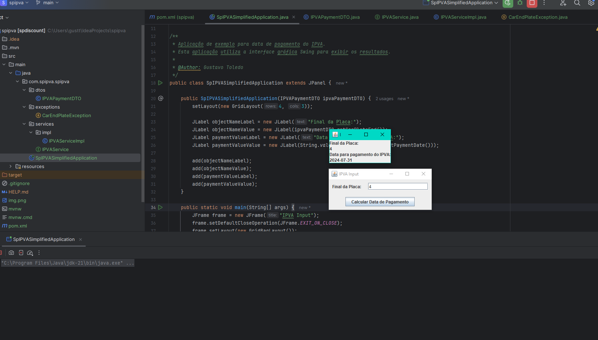

# SpIPVASimplifiedApplication

## Descrição

A **SpIPVASimplifiedApplication** é uma aplicação Java que permite ao usuário inserir o final da placa de um veículo e calcular a data de pagamento do IPVA. A aplicação exibe o final da placa e a data de pagamento utilizando uma interface gráfica Swing.


## Funcionalidades

- Inserção do final da placa do veículo.
- Cálculo da data de pagamento do IPVA com base no final da placa.
- Exibição do final da placa e da data de pagamento na interface gráfica.

## Tecnologias Utilizadas

- Java
- Swing para a interface gráfica
- Maven para gerenciamento de dependências

## Estrutura do Projeto

- `src/main/java/com/spipva/spipva/SpIPVASimplifiedApplication.java`: Classe principal da aplicação.
- `src/main/java/com/spipva/spipva/dtos/IPVAPaymentDTO.java`: Classe DTO para a data de pagamento do IPVA.
- `src/main/java/com/spipva/spipva/exceptions/CarEndPlateException.java`: Classe de exceção para final de placa inválido.
- `src/main/java/com/spipva/spipva/services/impl/IPVAServiceImpl.java`: Implementação do serviço de cálculo de data de pagamento do IPVA.

## Como Executar

1. Clone o repositório:
    ```sh
    git clone https://github.com/seu-usuario/spipva-simplified.git
    cd spipva-simplified
    ```

2. Compile o projeto usando Maven:
    ```sh
    mvn clean install
    ```

3. Execute a aplicação:
    ```sh
    mvn exec:java -Dexec.mainClass="com.spipva.spipva.SpIPVASimplifiedApplication"
    ```

## Exemplo de Uso

1. Ao executar a aplicação, uma janela será aberta solicitando o final da placa do veículo.
2. Insira o final da placa.
3. A aplicação calculará a data de pagamento do IPVA e exibirá os resultados na interface gráfica.



## Autor
- Gustavo Toledo